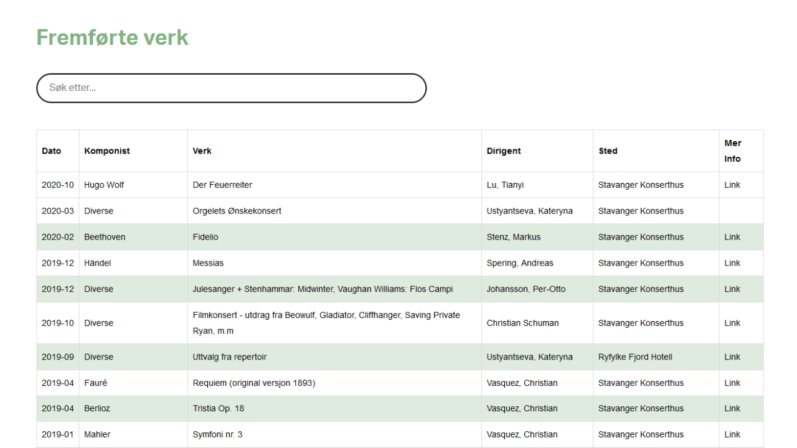

# Generate HTML tables from CSV files

This is a tool to quickly convert huge datatables to formated HTML. 

Replace `convert.csv` with desired table information and run either fo the modified `converter.py` spripts.

### Output

